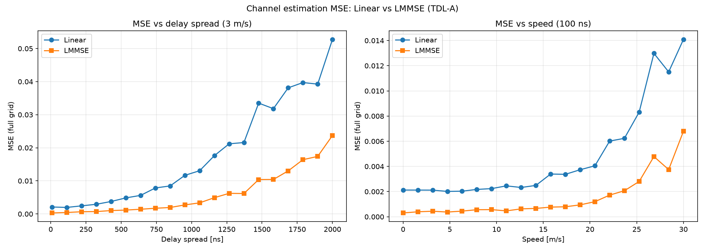

# Linear vs LMMSE Channel Interpolation

Compares **linear** and **LMMSE** DMRS-based channel estimation on an NR PUSCH resource grid using the 3GPP TDL-A channel model (Sionna).

Two sweeps are run at fixed SNR (noise variance 0.01):

| Sweep | Fixed parameter | Varied parameter |
|-------|-----------------|------------------|
| Left plot | Speed = 3 m/s | Delay spread 10–2000 ns |
| Right plot | Delay spread = 100 ns | Speed 0–30 m/s (30 m/s ≈ 108 km/h) |

MSE is computed over the full resource grid after LS estimation at pilot locations.

## Run

```bash
python linear_vs_lmmse_interpolator.py
```

The script prints MSE tables to the terminal and saves the figure to `imgs/mse_comparison.png`.

## Result


