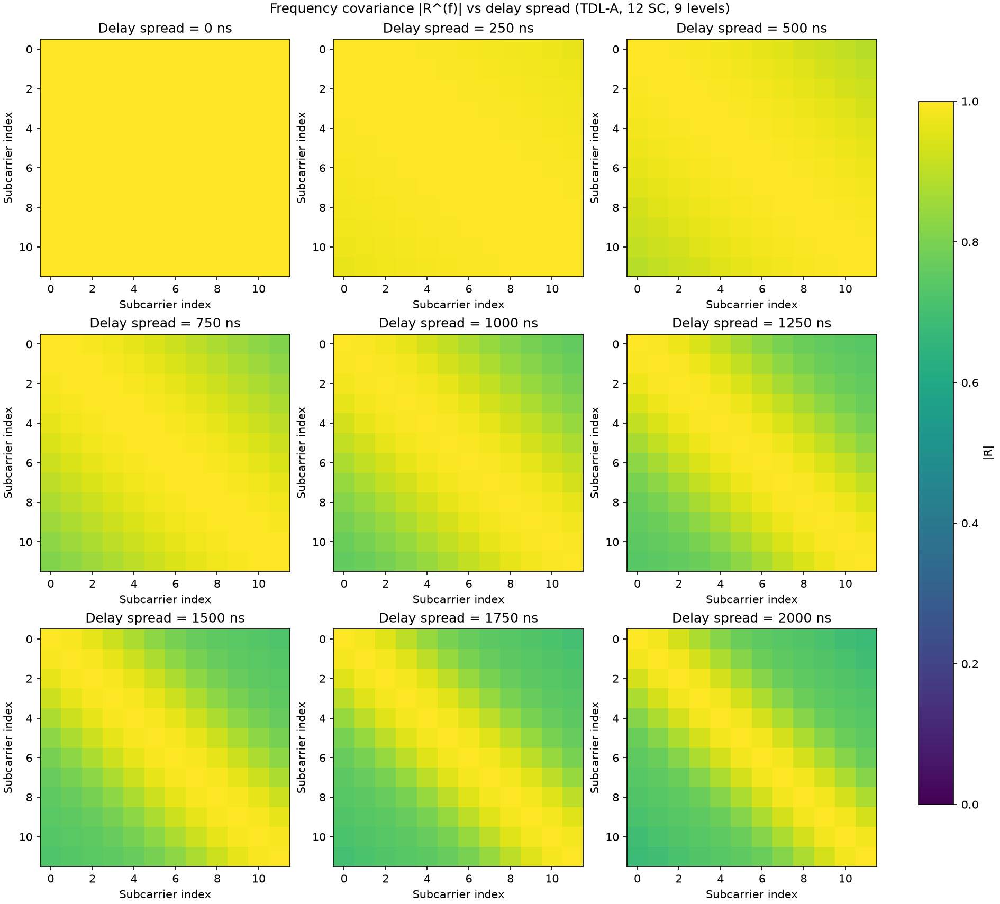
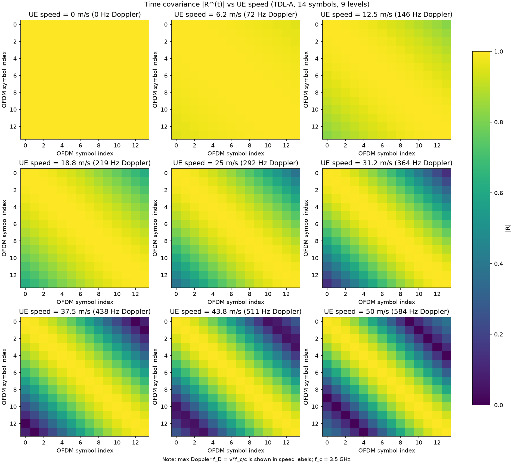

# Linear vs LMMSE Channel Interpolation

Compares **linear** and **LMMSE** DMRS-based channel estimation on an NR PUSCH resource grid using the 3GPP TDL-A channel model (Sionna).

Two sweeps are run at fixed SNR (noise variance 0.01):

| Sweep | Fixed parameter | Varied parameter |
|-------|-----------------|------------------|
| Left plot | Speed = 3 m/s | Delay spread 10–2000 ns |
| Right plot | Delay spread = 100 ns | Speed 0–30 m/s (30 m/s ≈ 108 km/h) |

MSE is computed over the full resource grid after LS estimation at pilot locations.

## Run

```bash
python linear_vs_lmmse_interpolator.py
```

The script prints MSE tables to the terminal and saves the figure to `imgs/mse_comparison.png`.

## Result


## Covariance matrices (`cov.py`)

Visualizes the TDL-A covariance matrices used by LMMSE interpolation:

| Matrix | Size | Sweep (9 levels) |
|--------|------|------------------|
| **R⁽ᶠ⁾** (`tdl_freq_cov_mat`) | 12×12 complex | Delay spread 0–2000 ns (1 PRB, 15 kHz SCS) |
| **R⁽ᵗ⁾** (`tdl_time_cov_mat`) | 14×14 complex | UE speed 0–50 m/s (14 OFDM symbols, 3.5 GHz) |

Time-covariance subplot titles include Doppler, e.g. `6.2 m/s (72 Hz Doppler)` with \(f_D = v f_c / c\).

```bash
python cov.py
```

**Outputs**

| File | Content |
|------|---------|
| `cov.txt` | Full 12×12 / 14×14 complex matrices per sweep level |
| `imgs/cov_freq_delay_spread.png` | \|R⁽ᶠ⁾\| heatmaps vs delay spread |
| `imgs/cov_time_speed.png` | \|R⁽ᵗ⁾\| heatmaps vs UE speed |

See [lmmse.md](lmmse.md) for how **R⁽ᶠ⁾** and **R⁽ᵗ⁾** enter the LMMSE Wiener filter.




