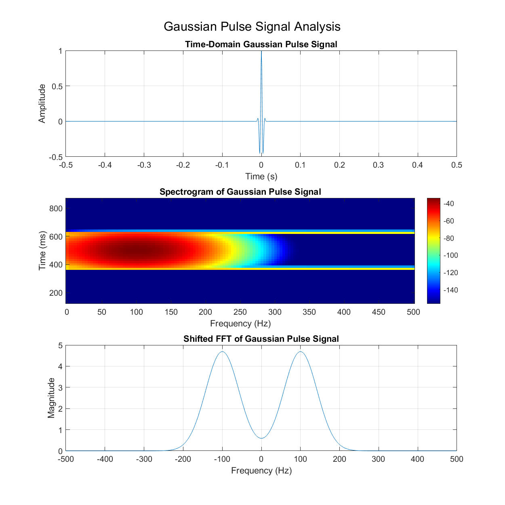

# Waveform

https://www.mathworks.com/help/signal/waveform-generation.html

### sin: Sine of argument in radians

The image above shows a single-tone sine wave signal analysis with three subplots:
1. Time-domain signal showing the sine wave
2. Spectrogram displaying the frequency content over time
3. Shifted FFT showing the frequency spectrum centered at zero

The signal parameters are:
- Sampling frequency: 1000 Hz
- Duration: 1 second
- Frequency: 100 Hz
- Amplitude: 1

### chirp: Swept-frequency cosine

The image above shows a chirp signal analysis with three subplots:
1. Time-domain signal showing the linear frequency sweep
2. Spectrogram displaying the frequency content over time
3. Shifted FFT showing the frequency spectrum centered at zero

The signal parameters are:
- Sampling frequency: 1000 Hz
- Duration: 1 second
- Starting frequency: 50 Hz
- Ending frequency: 300 Hz

### square: Square wave

The image above shows a square wave signal analysis with three subplots:
1. Time-domain signal showing the square wave
2. Spectrogram displaying the frequency content over time
3. Shifted FFT showing the frequency spectrum centered at zero

The signal parameters are:
- Sampling frequency: 1000 Hz
- Duration: 1 second
- Fundamental frequency: 100 Hz

### sawtooth: Sawtooth or triangle wave

The image above shows a sawtooth wave signal analysis with three subplots:
1. Time-domain signal showing the sawtooth wave
2. Spectrogram displaying the frequency content over time
3. Shifted FFT showing the frequency spectrum centered at zero

The signal parameters are:
- Sampling frequency: 1000 Hz
- Duration: 1 second
- Fundamental frequency: 100 Hz

### randn: Normally distributed random numbers

The image above shows a random noise signal analysis with three subplots:
1. Time-domain signal showing the random noise
2. Spectrogram displaying the frequency content over time
3. Shifted FFT showing the frequency spectrum centered at zero

The signal parameters are:
- Sampling frequency: 1000 Hz
- Duration: 1 second
- Signal type: Gaussian white noise

### sinc: Sinc function

The image above shows a sinc signal analysis with three subplots:
1. Time-domain signal showing the sinc function
2. Spectrogram displaying the frequency content over time
3. Shifted FFT showing the frequency spectrum centered at zero

The signal parameters are:
- Sampling frequency: 1000 Hz
- Duration: 1 second
- Reference frequency: 100 Hz

### rectpuls: Sampled aperiodic rectangle

The image above shows a rectangular pulse signal analysis with three subplots:
1. Time-domain signal showing the rectangular pulse
2. Spectrogram displaying the frequency content over time
3. Shifted FFT showing the frequency spectrum centered at zero

The signal parameters are:
- Sampling frequency: 1000 Hz
- Duration: 1 second
- Reference frequency: 100 Hz

### pulstran: Pulse train

The image above shows a pulse train signal analysis with three subplots:
1. Time-domain signal showing the pulse train
2. Spectrogram displaying the frequency content over time
3. Shifted FFT showing the frequency spectrum centered at zero

The signal parameters are:
- Sampling frequency: 1000 Hz
- Duration: 1 second
- Pulse period: 0.2 seconds (5 Hz)
- Pulse width: 0.05 seconds

### gauspuls: Gaussian-modulated sinusoidal RF pulse

The image above shows a Gaussian pulse signal analysis with three subplots:
1. Time-domain signal showing the Gaussian pulse
2. Spectrogram displaying the frequency content over time
3. Shifted FFT showing the frequency spectrum centered at zero

The signal parameters are:
- Sampling frequency: 1000 Hz
- Duration: 1 second
- Reference frequency: 100 Hz
- Bandwidth: 1

### gmonopuls: Gaussian monopulse

The image above shows a Gaussian monopulse signal analysis with three subplots:
1. Time-domain signal showing the Gaussian monopulse
2. Spectrogram displaying the frequency content over time
3. Shifted FFT showing the frequency spectrum centered at zero

The signal parameters are:
- Sampling frequency: 1000 Hz
- Duration: 1 second
- Reference frequency: 100 Hz

### diric: Dirichlet or periodic sinc function

The image above shows a Dirichlet pulse signal analysis with three subplots:
1. Time-domain signal showing the Dirichlet pulse
2. Spectrogram displaying the frequency content over time
3. Shifted FFT showing the frequency spectrum centered at zero

The signal parameters are:
- Sampling frequency: 1000 Hz
- Duration: 1 second
- Reference frequency: 100 Hz
- Number of samples in period: 10

### tripuls: Sampled aperiodic triangle

The image above shows a triangular pulse signal analysis with three subplots:
1. Time-domain signal showing the triangular pulse
2. Spectrogram displaying the frequency content over time
3. Shifted FFT showing the frequency spectrum centered at zero

The signal parameters are:
- Sampling frequency: 1000 Hz
- Duration: 1 second
- Reference frequency: 100 Hz
- Pulse width: 0.01 seconds

### vco: Voltage-controlled oscillator

The image above shows a VCO (Voltage-Controlled Oscillator) signal analysis with three subplots:
1. Time-domain signal showing the VCO output with sawtooth control
2. Spectrogram displaying the frequency content over time
3. Shifted FFT showing the frequency spectrum centered at zero

The signal parameters are:
- Sampling frequency: 10000 Hz
- Duration: 2 seconds
- Frequency range: 0.1 to 0.4 times sampling frequency
- Control signal: Sawtooth wave
